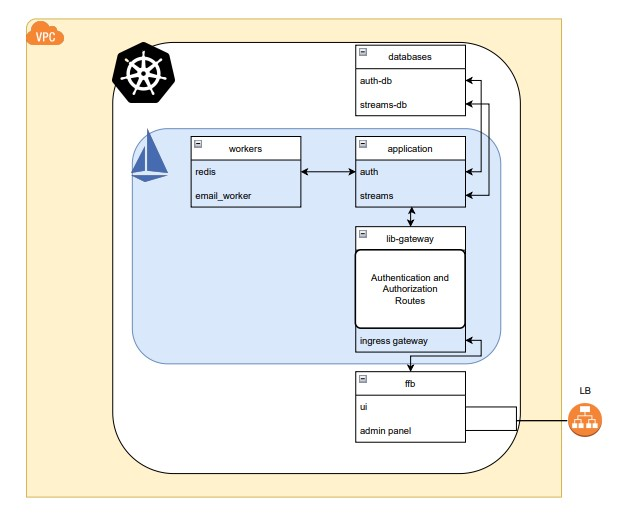
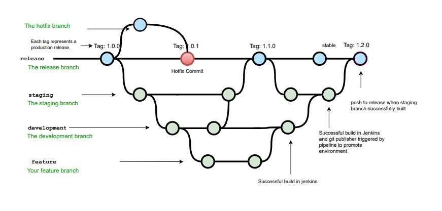
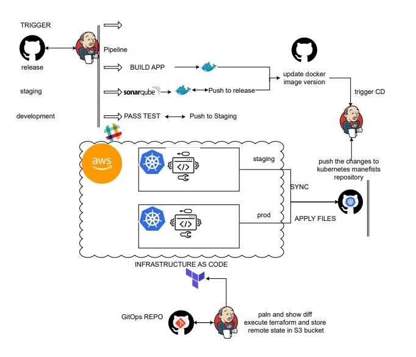
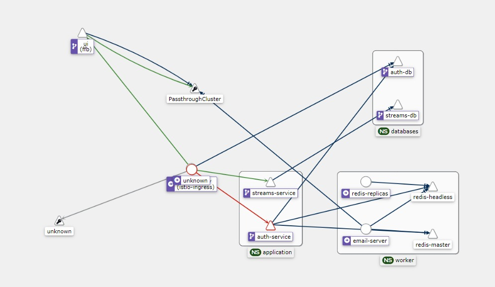

# MAJOR_PROJECT_DOCS
this repository collects all informations and documetations about all structures and remote 
repositories of the application

> this project have future work and some requirements to be added like extra security , extra test codes , underlying infra for tha application

# PROJECT IDEA
> The 360 degree live streaming system is used to provide user the real time experience through VR.
The live streaming system help in various sports , education sectors such as VR classroom, VR Sport matches(Football) etc.
# PROJECT WORKFLOW
> microservices application have 2 microservices one for user credentials and the other is to store embedded code for the live stream which is hosted on dacast live streaming Platform 
1 worker connected to redis broker under pub/sub communication for sending welcomed email to new users
seperated admin panel and user interface which are built in react framework
JWT for authn & authz 
appling devOps Practices and tools
## Application Architectureb

## GIT Workflow

## OPS Arch

## Visualization traffic from kiali

# HOW IT WORKS
embeded code stored in streams service to be fetched in frontend to stream the content which getting streaming by obs with dacast platform for video content with 360
user service where jwt getting issued and trusted

# HOW IT RUNS
each repository of them have readme file describes the service and its rule.
### it requires some types of setup:
* resources setup:
    - Minikube or any K8S Cluster
* networking setup:
    - istio installation 
* environment setup:
    - namespaces injections
    - kubernates package manager 
* CICD setup
    - jenkins server
    - sonarqube server
# Application repositories
### repo per service and branch per env follows them

[auth service](https://github.com/Waddah-Ahmad/MP_authservice.git "repo home") ,
 [streams service](https://github.com/Waddah-Ahmad/MP_streamservice.git "repo home") , 
[email service](https://github.com/Waddah-Ahmad/MP_emailservice.git "repo home"),
[User interface](https://github.com/Waddah-Ahmad/MP_UI.git "repo home")
,
[helmfile repo ](https://github.com/Waddah-Ahmad/MP_helmfiles.git "repo home")
,
[operation IAAC](https://github.com/Waddah-Ahmad/OPS_INFRA.git "repo home")
,
[manifist files](https://github.com/Waddah-Ahmad/MP_k8s-manifist.git "repo home")

# Dev&Ops
>### tools and technologies used in the project
## 1. backend technologies
* Django Rest Framework
* Gunicorn 
* Postgresql
* Celery & Redis
## 2. Frontend technologies
* React
* NginX
## 3. Stack technologies
* Docker Containers
* Kubernetes minikube cluster
* Helm
* Istio mesh
## 4. Monitoring technologies
* premithus
* kiali
## 5. CICD technologies
* SCM
* Jenkins
* SonarQube
* Slack Notification
* ArgoCD
* Helmfile
## 5. Extra technologies
* Terraform
